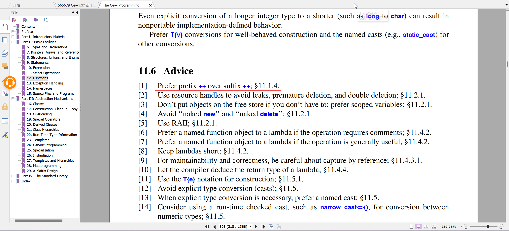
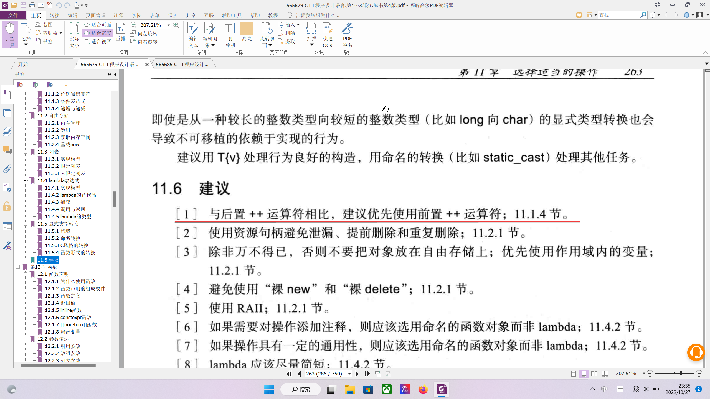

# （C++）前置自增与后置谁更快？

#### 介绍
测试不同情况下++i和i++的差异

#### 测试视频
[测试视频](https://www.bilibili.com/video/BV1oKBKY2EoK/?share_source=copy_web&vd_source=f356fef64ca0bb2e553b6ff070b44940)

#### 测试结果

#### 参与贡献
1.  Fork 本仓库
2.  新建 Feat_xxx 分支
3.  提交代码
4.  新建 Pull Request
